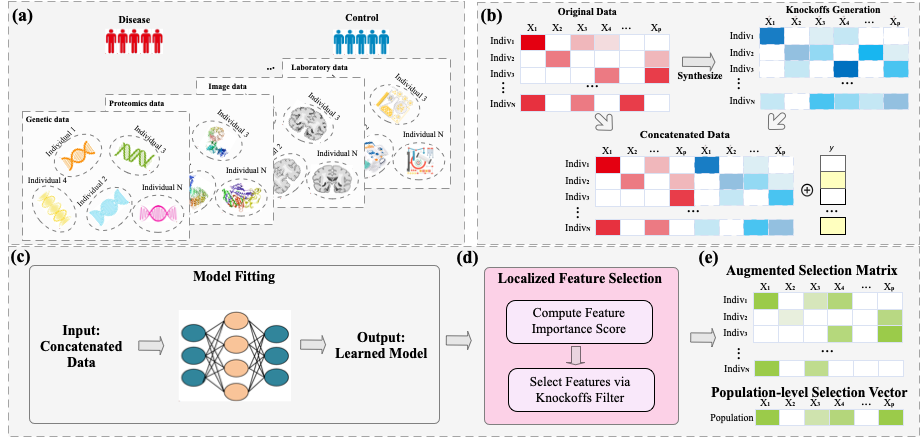

# knockoffFS

An R package for feature selection using knockoff methods.

## Installation

```r
# Install from GitHub
devtools::install_github("circustata/LocalizedFeatureSelection")
```

## Workflow



This diagram illustrates the main steps of the localized feature selection pipeline implemented in this package.

## Usage

The package provides three main functionalities:

1. Knockoff Generation
2. Model Training
3. Localized Feature Selection

### Example

```r
# The input data should be a matrix X where columns represent features and rows represent samples, along with response variable y.

# 1. Generate knockoffs for the data using IPAD procedure
# The selection of hyperparameter r is based on examining the off-diagonal elements of the covariance matrix 
# of the residuals to ensure valid knockoffs construction. Specifically, we iteratively increase r 
# and calculate the off-diagonal elements of the residual covariance matrix until their average 
# value falls below the predefined threshold (default: 0.01).
X_k <- knockoffs_generate(X, threshold = 0.01)

# 2. Model training 
model <- model_training(X, X_k, y)

# 3. Localized Feature Selection
# If you want to get results for the same data used in training, use X and X_k
# Otherwise, provide the new data you want to analyze
result <- feature_selection(
    model$trained_model,
    X,  # or new data
    X_k,  # or knockoffs for new data
    fdr_threshold = 0.1  # target FDR threshold
)
```

## Output Description

The `feature_selection` function returns a list containing:

- `augmented_selection_matrix`: The normalized selection matrix as defined in the paper, suitable for downstream analysis
- `Q`: q-value matrix where Q[i, j] < = FDR threshold indicates the j-th feature is selected for the i-th individual
- `W_out`: Localized W statistics representing individualized feature importance

## Author

Xiaoxia Liu (xxliu@stanford.edu)

## License

This project is licensed under the MIT License - see the LICENSE file for details. 